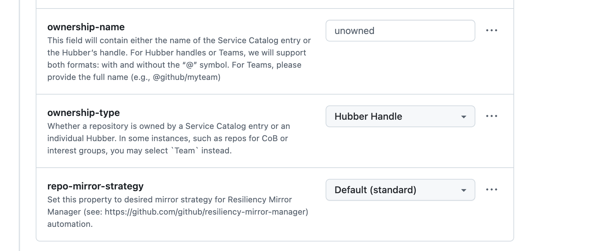
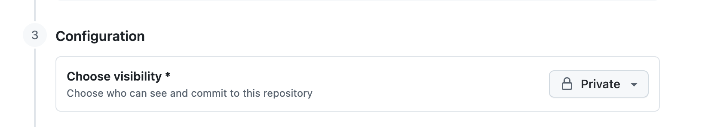

# Career Portfolio Starter

[](./.portfolio-starter-version)
[](./README.md)
[](#built-in-copilot-commands)
[](#privacy-model)

One private repo for capturing career evidence before you need it for a 1:1, Workday Reflection (GitHub's semiannual performance reflection process), promotion conversation, or goal update.

Career Portfolio Starter helps you build a small habit: save impact and feedback while the work is still fresh, then turn that evidence into manager-ready talking points, reflection drafts, and promotion-readiness narratives when the moment arrives.

It is designed for individual contributors and managers who want a private place to collect career evidence before the next review cycle, manager conversation, or promotion-readiness discussion.

Built and maintained by `@hemory` for GitHub employees using Copilot to manage career evidence.

## Before you start

You need:

- A GitHub account with access to GitHub Copilot in VS Code, Codespaces, or Copilot CLI.
- A private copy of this template before adding career evidence.
- Copilot opened from your private repo so it can read and create files in the right place.
- Git authentication set up for private repos if you plan to clone locally. VS Code can prompt you to sign in. From a terminal, `gh auth login` is the easiest setup path if you use the GitHub CLI.

## Start here

Start by creating your own private copy of this template. Then choose the path that matches how you want to use Copilot:

- **Copilot CLI:** best if you are comfortable in a terminal and want Copilot to clone and open the repo for you.
- **VS Code:** best if you want a local editor experience with Copilot Chat in the side panel.
- **Codespaces:** best if you want to work entirely in the browser without cloning anything locally.

If you already have an older private copy, start with [Updating your private copy](#updating-your-private-copy) so the latest skills are available.

### Create your private copy

1. Click **[Use this template](https://github.com/github/career-portfolio-starter/generate)** and choose **Create a new repository**.
2. Give your copy a name, such as `my-career-portfolio`.
3. Set the repository **Owner** to the account or organization where you are allowed to create your private copy.
4. If required repository properties appear, set:
   - **ownership-name:** your GitHub handle without the `@` symbol.
   - **ownership-type:** `Hubber Handle`.
   - **repo-mirror-strategy:** `Default (standard)`.

   

5. Set visibility to **Private** before adding career evidence.

   

6. Click **Create repository**.

<details>
<summary><strong>Use Copilot CLI</strong></summary>

Use this path if you want to set up the portfolio from your terminal.

1. On your new private repository page, click **Code**.
2. Copy the repository URL.
3. Open the terminal on your machine.
4. Start Copilot CLI:

   ```bash
   copilot
   ```

5. Ask Copilot to clone your private repository locally. Paste the URL you copied in step 2. For example:

   ```text
   Clone https://github.com/YOUR-HANDLE/my-career-portfolio.git locally.
   ```

6. Ask Copilot to move into the cloned repo. For example:

   ```text
   Navigate into the cloned career portfolio repo.
   ```

7. Confirm Copilot is in the repo root, the folder that includes `README.md`, `impact-notes/`, `feedback/`, and `growth-plan/`.
8. Run:

   ```text
   /get-started
   ```

9. Follow the one next action Copilot recommends.

</details>

<details>
<summary><strong>Use VS Code</strong></summary>

Use this path if you want a local editor with Copilot Chat.

1. On your new private repository page, click **Code**.
2. Copy the repository URL.
3. Open VS Code.
4. Open the Command Palette.
   - macOS: `Command+Shift+P`
   - Windows/Linux: `Ctrl+Shift+P`
5. Run **Git: Clone**.
6. Paste your private repository URL.
7. Choose where to save the repo locally.
8. When VS Code asks, open the cloned repository.
9. Open Copilot Chat.
10. Make sure the repository root is the active workspace, the folder that includes `README.md`, `impact-notes/`, `feedback/`, and `growth-plan/`.
11. Run:

    ```text
    /get-started
    ```

12. Follow the one next action Copilot recommends.


</details>

<details>
<summary><strong>Use Codespaces</strong></summary>

Use this path if you want to work in the browser.

1. Open your new private repository on GitHub.
2. Click **Code**.
3. Open the **Codespaces** tab.
4. Click **Create codespace on main**.
5. Wait for the codespace to finish opening.
6. Open Copilot Chat in the Codespace.
7. Confirm the repository root is open, the folder that includes `README.md`, `impact-notes/`, `feedback/`, and `growth-plan/`.
8. Run:

   ```text
   /get-started
   ```

9. Follow the one next action Copilot recommends.


</details>

### If you already have a private copy

1. Open your private repo in Copilot CLI, VS Code, or Codespaces.
2. Run `/get-started`.
3. Follow the one next action Copilot recommends.

If `/get-started` is not recognized, confirm you opened Copilot from the private repo root. If it still does not appear, restart Copilot from that repo and try again. Older copies may need [Updating your private copy](#updating-your-private-copy) first.

## What you get

Most career evidence gets reconstructed too late. Reflection season arrives, promotion-readiness questions come up, or a manager asks for examples, and suddenly you are trying to remember six months of work from Slack, issues, docs, and memory.

This starter gives you a private, structured place to:

| Need | What this repo gives you |
|---|---|
| Capture impact while it is fresh | `/new-impact-note` saves what changed because of work you shipped, improved, decided, facilitated, or unblocked. |
| Preserve useful feedback | `/capture-feedback` saves Slack messages, PR or issue comments, emails, Workday snippets, screenshots, document comments, meeting notes, and paraphrases with source context. |
| Find possible evidence from sources you choose | `/discover-impact` creates candidate signals for review before anything becomes evidence. |
| Prepare for a manager 1:1 | `/prep-1on1` turns selected private evidence into manager-safe talking points and calibration asks. |
| Draft reflections from proof | `/draft-reflection` helps draft Workday Reflection answers from sourced evidence instead of memory. |
| Respond to a direct report's Reflection | `/manager-reflection-reply` helps people managers draft one Workday manager response from the employee's raw Workday paste, peer feedback, goals, approved evidence, and role context, plus short grounding checks. |
| Explore promotion readiness | `/prep-promotion` compares your portfolio evidence to role expectations and separates readiness from business need. |
| Learn the pattern safely | `examples/README.md` shows synthetic examples before you add your own evidence. |

## Privacy model

This repo is designed to be **private by default**.

- You own your private copy.
- This is your private workspace for career evidence.
- Manager-facing use is opt-in and should happen through selected excerpts, talking points, or artifacts you choose to share.
- `/prep-1on1` separates private source notes from shareable talking points so you can decide what, if anything, to bring into the conversation.
- `/manager-reflection-reply` is for people managers and produces copy-ready Workday response text plus short reference, GitHub evidence, and peer feedback grounding checks. It can surface optional manager review notes for blind spots, but it does not create hidden manager notes, ratings, promotion recommendations, or calibration packets.
- `/discover-impact` is optional and consent-based. It works only from sources you provide and creates candidate signals for review, not final evidence or manager-ready claims.

_This is not a manager dashboard, not Workday, not a performance rating tool, and not a promotion decision tool. It is a workspace that helps you collect better evidence for the conversations and systems that already exist._

## Choose your workflow

Start with `/get-started` if you are new. Copilot will scan your private copy, tell you what is still placeholder content, and recommend one next step.

If you already know what you need, jump straight to the matching workflow:

| Moment | Run | Outcome |
|---|---|---|
| You just shipped, improved, decided, facilitated, or unblocked something meaningful | `/new-impact-note` | Captures a quick impact note you can enrich later. |
| Someone gave you feedback | `/capture-feedback` | Saves pasted text, screenshot summaries, PR or issue comments, emails, Workday snippets, meeting notes, and paraphrases with source context and reuse notes. |
| You want help finding possible impact from sources you choose | `/discover-impact` | Creates an impact inbox from user-provided source links or pasted excerpts so you can review candidates before saving evidence. |
| You have a manager 1:1 coming up | `/prep-1on1` | Pulls selected recent evidence into private source notes, manager-safe talking points, and calibration asks. |
| You are closing out a quarter | `/quarterly-reflection` | Saves a durable private quarterly reflection for your portfolio. |
| Reflection season is here | `/draft-reflection` | Drafts Workday Reflection answers from sourced evidence. |
| You manage people and need to respond to a direct report's Workday Reflection | `/manager-reflection-reply` | Drafts one Workday manager response from the employee's raw Workday paste, prior goals, peer feedback, approved evidence, and role context, then shows whether role-profile, GitHub evidence, and peer feedback grounding were used. |
| You are exploring promotion readiness | `/prep-promotion` | Calibrates portfolio evidence against role expectations, saves a readiness snapshot, identifies strengths and gaps, and separates readiness from business need. |
| You want to see safe examples first | Read `examples/README.md` | Shows synthetic patterns for impact, feedback, 1:1 prep, reflection, and promotion readiness coaching. |
| You are unsure | `/help` | Shows the command guide by work moment. |

### What each workflow saves

Different workflows create different kinds of artifacts so the repo stays useful without cluttering your private record with every temporary prep draft.

| Workflow | Purpose | What gets saved |
|---|---|---|
| `/quarterly-reflection` | Private quarterly career retrospective | A durable reflection at `reflections/FYXX-QN-reflection.md`. This is part of your long-term portfolio record and can later feed Workday reflection or promotion prep. |
| `/draft-reflection` | Workday-ready self-review drafting walkthrough | A durable Workday draft at `reflections/FYXX-HN-workday-draft.md`, plus temporary resume state at `reflections/.draft-reflection-state.json` while the walkthrough is in progress. The state file is deleted when you finalize. |
| `/manager-reflection-reply` | People-manager response drafting for a direct report's Workday Reflection | Uses temporary resume state at `reflections/.manager-reflection-reply-state.json` while intake and drafting are in progress, then saves a Markdown draft by default at `reflections/manager-replies/YYYY-MM-DD-employee-name-manager-response.md`. |
| `/prep-1on1` | Manager conversation prep for a specific meeting | Does not auto-save shareable talking points. You can choose to save only private source notes to `growth-plan/1on1-prep/YYYY-MM-DD.md`, or append follow-up decisions to `growth-plan/manager-calibration.md`. |
| `/prep-promotion` | Promotion readiness coaching and manager calibration | A durable readiness snapshot in `growth-plan/`, so you can compare strengths, gaps, and evidence movement over time. |

## Built-in Copilot commands

This repo ships with Copilot skills for every portfolio workflow. They work in VS Code, Codespaces, and Copilot CLI when Copilot is started from the private repo root and can read and create files.

### Where to type the commands

- **VS Code:** Open your private repo, open Copilot Chat, then type the slash command, such as `/get-started`.
- **Codespaces:** Open your private repo in a Codespace, open Copilot Chat, then type the slash command.
- **Copilot CLI:** In a terminal, `cd` into your private repo root, start Copilot CLI, then type the slash command at the CLI prompt.

| Command | When to use it | Supported interfaces |
|---|---|---|
| `/get-started` | First time setup or repo status check | VS Code, Codespaces, Copilot CLI |
| `/help` | You want the command guide | VS Code, Codespaces, Copilot CLI |
| `/new-impact-note` | After a ship, improvement, decision, facilitation moment, or unblocked work | VS Code, Codespaces, Copilot CLI |
| `/capture-feedback` | After Slack, email, PR, issue, screenshot, meeting, Workday-style, or paraphrased feedback | VS Code, Codespaces, Copilot CLI |
| `/discover-impact` | Optional candidate discovery from user-provided source links or pasted excerpts | VS Code, Codespaces, Copilot CLI |
| `/update-starter` | Update starter-owned workflow files without overwriting personal career evidence | VS Code, Codespaces, Copilot CLI |
| `/quarterly-reflection` | End-of-quarter personal reflection | VS Code, Codespaces, Copilot CLI |
| `/prep-1on1` | Before a manager 1:1 | VS Code, Codespaces, Copilot CLI |
| `/update-goals` | When goals need to reflect recent work | VS Code, Codespaces, Copilot CLI |
| `/draft-reflection` | During Workday Reflection season, GitHub's semiannual performance reflection process | VS Code, Codespaces, Copilot CLI |
| `/manager-reflection-reply` | For people managers responding to a direct report's Workday Reflection | VS Code, Codespaces, Copilot CLI |
| `/prep-promotion` | When calibrating promotion readiness, saving snapshots, and strengthening your impact narrative | VS Code, Codespaces, Copilot CLI |

Use the same slash commands in all supported interfaces. Natural-language requests also work when they clearly name the workflow, such as "create an impact note for this launch" or "run promotion readiness coaching and save a snapshot."

## Using Copilot CLI

You can maintain the portfolio from Copilot CLI without opening VS Code.

Start Copilot CLI from your private portfolio repo root, the folder that contains this README, then run the same commands:

```text
/get-started
/help
/new-impact-note
/capture-feedback
/discover-impact
/update-starter
/quarterly-reflection
/prep-1on1
/update-goals
/draft-reflection
/manager-reflection-reply
/prep-promotion
```

The CLI path uses the same privacy model as VS Code and Codespaces: user-owned evidence, candidate-first discovery, no manager-ready claims without approval, and no broad scanning unless you provide sources.

## Folder map

```text
my-career-portfolio/
|
|-- README.md
|
|-- impact-notes/
|   |-- TEMPLATE.md
|   `-- YYYY-MM-DD-my-impact-note.md
|
|-- feedback/
|   `-- FY26-Q3-peer-feedback.md
|
|-- impact-inbox/
|   `-- YYYY-MM-DD-discovery-candidates.md
|
|-- reflections/
|   |-- STARTER-quarterly-reflection.md
|   |-- STARTER-workday-draft.md
|   `-- manager-replies/
|       `-- YYYY-MM-DD-employee-name-manager-response.md
|
|-- growth-plan/
|   |-- career-profile.md
|   |-- current-goals.md
|   `-- manager-calibration.md
|
|-- reference/
|   |-- career-stage-profiles/
|   |-- career-fulfillment/
|   |-- career-stage-profiles-summary.md
|   `-- other HR and career references
|
|-- examples/
|   `-- synthetic calibration examples
|
`-- scripts/
    `-- update-safe-files.sh
```

The folders are intentionally simple:

- `impact-notes/`: evidence from work you shipped, improved, decided, facilitated, or unblocked.
- `feedback/`: evidence from what others said about your work.
- `impact-inbox/`: optional, user-reviewed candidate signals from sources you choose. Candidates are not evidence until you approve and save them elsewhere.
- `growth-plan/`: your career profile, goals, and manager calibration notes.
- `reflections/`: durable quarterly reflections and Workday Reflection drafts. `/draft-reflection` uses a temporary `.draft-reflection-state.json` file here while a walkthrough is in progress. `/manager-reflection-reply` uses a temporary `.manager-reflection-reply-state.json` file here while intake and drafting are in progress, then saves manager-response drafts under `reflections/manager-replies/`.
- `reference/`: GitHub career-stage, promotion, reflection, and Career Fulfillment references used by the workflows.
- `examples/`: synthetic examples for learning the patterns without exposing real career evidence.

## How the reference layer works

The `reference/` folder gives Copilot source material for reflection, promotion, goals, and role-specific evidence mapping.

For role-specific career-stage guidance, start with the curated summaries in [`reference/career-stage-profiles/curated/README.md`](reference/career-stage-profiles/curated/README.md). Each generated raw Career Stage Profile extract has a curated summary for first-pass evidence mapping, plus a raw fallback for exact wording, full responsibility tables, or manager calibration. Product Org extensions that were already present as legacy `.txt` extracts, such as Product Operations, are indexed under [`reference/career-stage-profiles/curated/product-org/README.md`](reference/career-stage-profiles/curated/product-org/README.md).

Raw extracts from Career Stage Profile PDFs and Career Fulfillment workshop packets should be treated as source material, not final user guidance. If a role-specific reference is missing, workflows should say so rather than invent expectations.

`reference/impact-discovery/README.md` defines the optional impact discovery model. Discovery is intentionally candidate-first: the workflow can help organize user-provided links or pasted source excerpts, but it should not broadly scan work systems, create final evidence, or prepare manager-ready material without user review.

## Updating your private copy

Your private copy can pull the latest starter workflow files without overwriting your personal evidence.

Use this when you already have a private Career Portfolio Starter repo and want the latest skills, templates, examples, references, changelog, and version metadata.

### What the updater changes

The updater can replace starter-owned workflow files like repo instructions, skills, the impact-note template, reference material, synthetic examples, version metadata, changelog, and the updater script itself.

It does **not** overwrite your personal career evidence, including files in `impact-notes/`, `feedback/`, `reflections/`, `growth-plan/`, or manager calibration history. It also does not manage local editor workspace settings such as `.vscode/settings.json`.

### Recommended path: run the updater twice

Run these commands from the root of your private Career Portfolio Starter repo.

If you are using Copilot CLI or a terminal:

1. Open your private Career Portfolio Starter repo.
2. Make sure you are in the repo root, the folder that contains `README.md`, `impact-notes/`, `feedback/`, and `scripts/`.
3. Run:

```bash
./scripts/update-safe-files.sh
./scripts/update-safe-files.sh
```

Run it twice because older copies may update the updater itself on the first run. The second run uses the refreshed updater to pull the latest skill files and remove retired prompt files.

After the update finishes, exit your current Copilot CLI or terminal session and start a new one from the repo root. This helps Copilot recognize newly added or changed skills.

### If the script is missing

Some older copies may not have `scripts/update-safe-files.sh` yet. If you run the command above and see an error like `No such file or directory`, use this bootstrap path from the root of your private Career Portfolio Starter repo:

This bootstrap path requires the [GitHub CLI](https://cli.github.com/) (`gh`) to be installed and authenticated with access to `github/career-portfolio-starter`.

```bash
mkdir -p scripts
gh api repos/github/career-portfolio-starter/contents/scripts/update-safe-files.sh?ref=main \
  -H "Accept: application/vnd.github.raw" \
  > scripts/update-safe-files.sh
chmod +x scripts/update-safe-files.sh
./scripts/update-safe-files.sh
./scripts/update-safe-files.sh
```

Then exit your current Copilot CLI or terminal session and start a new one from the repo root.

### If you prefer the slash command

Newer copies include a Copilot command:

```text
/update-starter
```

This command wraps the same updater script. If `/update-starter` is available in your copy, you can use it. If it is not available, use the script path above.

## Getting help

- **Bug, broken command, confusing instruction, or feature request:** open an issue in the [canonical starter repo](https://github.com/github/career-portfolio-starter/issues).
- **Question about how to use the repo:** Slack `@hemory` directly.
- **Private career evidence:** keep it in your private copy. Do not paste it into public issues or broad Slack channels.

## Maintainer quality checks

The canonical starter repo runs automated quality gates on pull requests. The checks run updater regression tests, validate local Markdown links, verify version and changelog sync, and guard against known safety regressions like updater-managed editor settings or VS Code-only prompts in CLI-supported skills.

Run the same checks locally before opening a maintainer PR:

```bash
./scripts/check-quality-gates.sh
```

## The habit

You do not need a perfect portfolio. You need a small habit.

After meaningful work, save the signal while it is still fresh:

- Shipped, improved, decided, facilitated, or unblocked something? Run `/new-impact-note`.
- Got useful feedback? Run `/capture-feedback`. Exact copy/paste is best, but screenshots, meeting notes, PR or issue comments, emails, Workday snippets, and paraphrases are worth saving too.
- Want help finding possible evidence from sources you choose? Run `/discover-impact`, then review the candidates before saving anything.
- Preparing for a 1:1? Run `/prep-1on1`.

When reflection or promotion season arrives, the evidence is already there.
